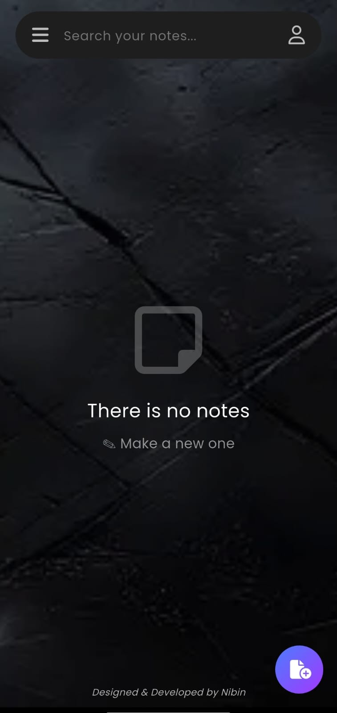
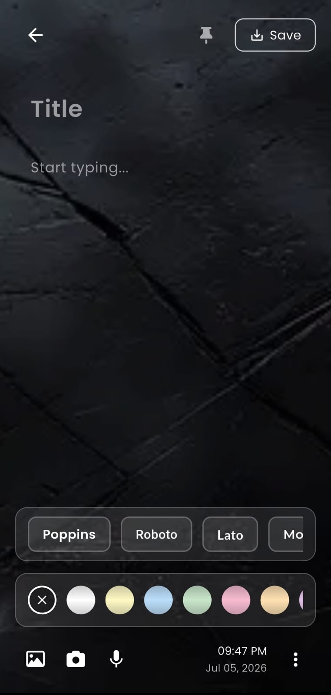
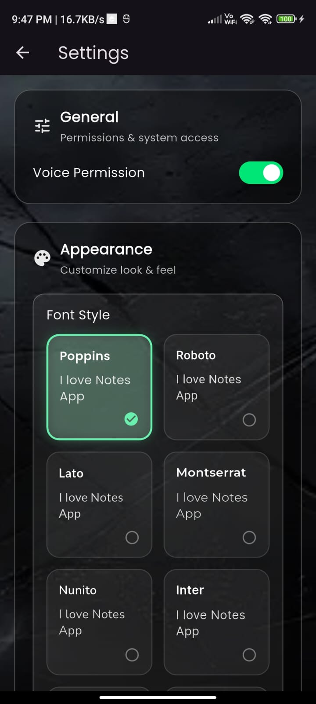

# Notes Application

A full-stack, offline-first personal note-taking application designed for performance and reliability. This project consists of a high-performance REST API built with .NET 8 and a modern, responsive mobile client built with Flutter.

Developed by Nibin Joseph.

  
  
  

## Project Architecture

This repository is structured into two main components:

- **NotesBackend**: A robust, modular .NET 8 Web API serving as the central synchronization and storage layer.
- **notes_app**: A Flutter mobile application prioritizing local performance and seamless offline availability.

### 1. The .NET 8 Backend (NotesBackend)

The backend is the cornerstone of this project, engineered with a strong emphasis on scalable enterprise patterns. It is built using **.NET 8** and **C#**, providing a highly secure and performant REST API.

**Backend Highlights:**
- **Modular Monolith Design**: The application is divided into cohesive feature modules (Notes, Uploads), following Controller-Service-Repository patterns to ensure clean separation of business logic and data access.
- **Entity Framework Core**: Utilizes EF Core 8 for Object-Relational Mapping, strictly managing the PostgreSQL database schema through code-first migrations.
- **Data Transfer Objects (DTOs)**: API boundaries are rigorously protected using DTOs and mappers to prevent internal database structures from leaking to the client.
- **Media Handling**: Dedicated multipart-form endpoints efficiently process and host image and audio uploads.

### 2. The Flutter Client (notes_app)

The mobile application is built with Flutter and Riverpod, designed specifically around an offline-first architecture to guarantee instantaneous user interactions.

**Client Highlights:**
- **Offline-First Synchronization**: Notes are instantly persisted to a local NoSQL database (Hive). Background tasks silently synchronize the payload to the .NET backend without interrupting the user experience.
- **Media Upload Pipeline**: When local media (images, audio recordings) is detected, the application asynchronously uploads the assets to the .NET backend, retrieves the hosted URLs, and seamlessly swaps local paths for HTTP references during the database sync.
- **Real-Time Local Search**: A highly optimized full-text search mechanism powered by Riverpod filters the local database instantly as the user types.

## Tech Stack

**Backend System:**
- Framework: .NET 8 (ASP.NET Core Web API)
- Language: C# 12
- Database: PostgreSQL
- ORM: Entity Framework Core 8

**Frontend Client:**
- Framework: Flutter
- Language: Dart
- State Management: Riverpod
- Local Database: Hive NoSQL

## Getting Started

### Running the Backend

1. Navigate to the `NotesBackend` directory.
2. Ensure you have the .NET 8 SDK and PostgreSQL installed.
3. Configure the `DB_CONNECTION_STRING` inside the `.env` file.
4. Execute `dotnet ef database update` to apply the migrations.
5. Execute `dotnet run` to start the API on port 5103.

### Running the Frontend

1. Navigate to the `notes_app` directory.
2. Execute `flutter pub get` to fetch dependencies.
3. Execute `flutter run` on an attached Android or iOS device.

---

License: This project is open for learning and personal use. Redistribution or republishing as-is is not permitted without permission.
